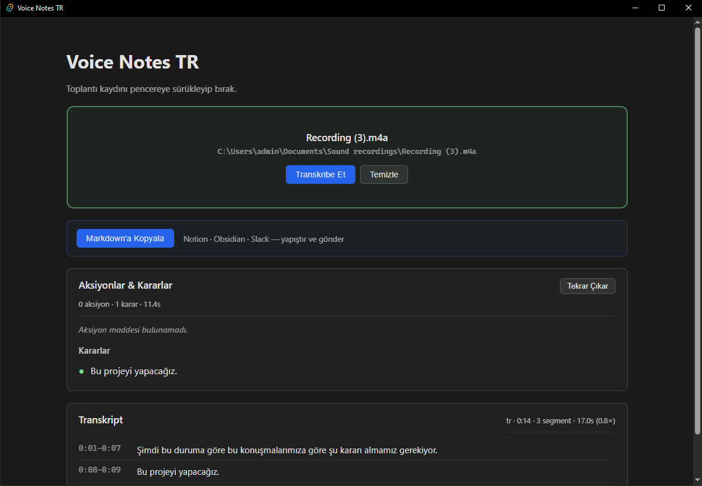

# Voice Notes TR

Türkçe sesli toplantı notu üretici — **tamamen lokal**, internet gerek yok.

Bir m4a/mp3 yükle → Türkçe transkript + aksiyon maddeleri + kararlar → Markdown'a kopyala → Notion/Obsidian/Slack'e yapıştır.



## Ne yapar

- Toplantı kaydını **sürükle-bırak** ya da **dosya seç** ile alır (M4A, MP3, WAV, FLAC, OGG, AAC, OPUS, WEBM)
- Türkçe transkript çıkarır (`faster-whisper large-v3-turbo`, ~11× realtime GPU'da)
- Transkripten **aksiyon maddeleri** (kim, ne) ve **kararlar** çıkarır (Gemma 3 4B, Türkçe)
- Tek tıkla **Markdown'a kopyalar** — başlık, tarih, aksiyonlar, kararlar, zaman damgalı transkript
- **Hiçbir veri buluta gitmez** — Whisper modeli yerel, LLM yerel, kayıt yerel

## Niye var

Otter, Fireflies, Microsoft Copilot gibi araçlar var ama:

- **Türkçe transkript kalitesi düşük** — modeller İngilizce odaklı
- **Bulut zorunlu** — KVKK / şirket içi gizli toplantı için kullanılamaz
- **Pahalı** — küçük takımlar $30/kullanıcı/ay ödeyemez

Bu proje üçünü birden çözer: yerel dil, yerel işlem, sıfır maliyet.

## Durum

**V1 yayında** — dosya modu çalışıyor uçtan uca. Bkz. [ROADMAP.md](./ROADMAP.md).

| Faz | Durum |
|---|---|
| Faz 0 — setup + iskelet | ✅ |
| Faz 1 — dosya modu MVP | ✅ |
| Faz 2 — canlı mikrofon modu | ⏳ |
| Faz 3 — SQLite geçmiş + dağıtım | ⏳ |

## Kurulum

### 1. Ön gereksinimler

| Şart | Versiyon | Niye |
|---|---|---|
| [Node.js](https://nodejs.org/) | 18+ | frontend (Vite + React) |
| [Rust](https://rustup.rs/) | stable | Tauri backend derleme |
| [Python](https://python.org/) | 3.10 - 3.12 | Whisper sidecar |
| [uv](https://docs.astral.sh/uv/) | son | Python deps (`pip install uv`) |
| [Ollama](https://ollama.com/download) | 0.24+ | LLM runtime |

### 2. Modelleri indir

```bash
ollama pull gemma3:4b   # 3.3 GB
```

(Whisper modeli ilk transkribe çağrısında HuggingFace'den otomatik iner ~1.5GB.)

### 3. Python sidecar'ı kur

```powershell
cd sidecar
uv venv --python 3.10
uv pip install --python .venv\Scripts\python.exe faster-whisper
# Windows + NVIDIA GPU için ek:
uv pip install --python .venv\Scripts\python.exe nvidia-cublas-cu12 'nvidia-cudnn-cu12>=9.0,<10.0'
```

### 4. Frontend deps + Tauri dev

```powershell
cd ..
npm install
npm run tauri:dev
```

İlk Tauri build 5-10 dk sürer (Rust deps). Sonraki çalıştırmalar saniyeler.

## Kullanım

1. Pencereye bir ses dosyası sürükle (veya **Dosya Seç…** butonu)
2. **Transkribe Et** — Whisper modeli ilk açılışta ~10s yüklenir, sonra ~3s transcribe (35sn ses için)
3. Transkript bittiğinde **otomatik olarak** aksiyon + karar çıkarımı başlar (~15s)
4. Sonuç ekranında **Markdown'a Kopyala** — clipboard'a düşer, Notion/Obsidian/Slack'e yapıştır

## Stack

| Katman | Teknoloji |
|---|---|
| Desktop framework | [Tauri v2](https://tauri.app/) (Rust + TS) |
| UI | React 18 + TypeScript + Vite |
| Speech-to-text | [faster-whisper](https://github.com/SYSTRAN/faster-whisper) (Python sidecar) — `large-v3-turbo` |
| LLM | [Ollama](https://ollama.com/) + [Gemma 3 4B](https://ollama.com/library/gemma3) |
| IPC | JSON-over-stdio (sidecar) + HTTP (Ollama) |
| Audio decode | faster-whisper PyAV (m4a/mp3/wav/...) |

Mimari kararların **niye**si: [DECISIONS.md](./DECISIONS.md). Genel akış: [ARCHITECTURE.md](./ARCHITECTURE.md).

## Donanım gereksinimleri

| Seviye | CPU | RAM | GPU | Transcribe (60 dk audio) |
|---|---|---|---|---|
| Minimum | 4-core (AVX2) | 8 GB | yok | ~20 dk |
| Önerilen | 8-core modern | 16 GB | yok | ~8 dk |
| Optimal | 8-core modern | 16 GB | NVIDIA 4GB+ VRAM | ~2 dk |

Referans makine: i7-12700H + RTX 3050 Ti Laptop (4GB VRAM). 4GB VRAM ile Whisper + Gemma birlikte çalışırken bazı bellek manevraları gerekiyor; detay [DECISIONS.md #8](./DECISIONS.md).

## Geliştirici notları

- Kararlar: [DECISIONS.md](./DECISIONS.md) — 19 ana mimari karar
- DB şema (V1: kullanılmıyor, V2'de aktif): [SCHEMA.md](./SCHEMA.md)
- Yol haritası: [ROADMAP.md](./ROADMAP.md)
- Sidecar protokolü: [sidecar/README.md](./sidecar/README.md)

## Lisans

MIT — bkz. [LICENSE](./LICENSE).
